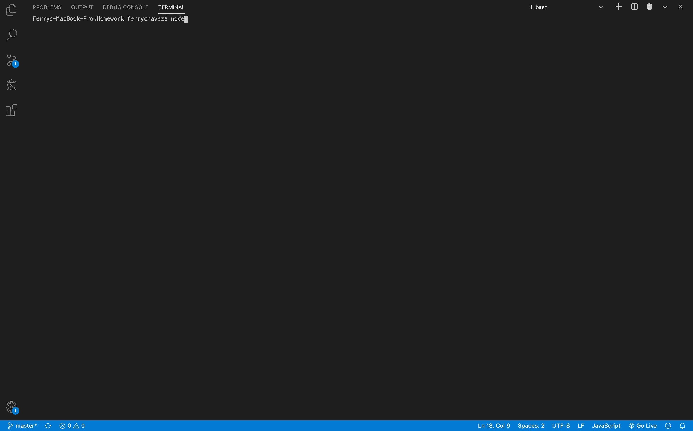

# 🗳 PROJECT NAME: Team Profile Generator

# 💻 Demo 

## 🗒 Project Description 
 
 This project helps you generate good README.md files via Node.
 
## ✨ TABLE OF CONTENTS 

            1. Usage

            2. Languages

            3. License

 
            
## 📚 Usage 
 
 This will make your life easier in making README files.
 
## 🙊 Languages Needed 
 
 JavaScript, Node
 
## 💳 License 
 
 This project is under the MIT license
 
 
## 🙌👏 Questions? 
  
This project exists thanks to this person who contributed. 